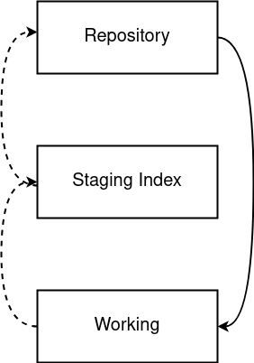

# Definition

Git is a system to track changes and version control. It was pioneered by Linus Torvald in 2005. 
Before Git, other version control systems were used such as SCCS, RCS and CVS. Unlike previous systems, 
Git performs distributed version control, this means the system tracks changes not a specific version and
there is no central repository. As there is no central repository, the system encourages participation, innovation 
and creating forks (copies) of existing code. 

## Three Tree Architecture

Git follows a 3 tree architecture.
- Working Copy: What you are working on
- Staging Index: Items prepared for commit to the repo
- Repo: Destination repository for items going to the repo.

___

## Git CLI Commands

| **Command** | **Description** |
| --------------|-------------------|
|`git help`| General help command |
|`git help log`| Help command for the git log command |
|`git log`| Lists a log of all commits|
|`git log - n 5`| Lists the 5 most recent entries |
|`git log --grep="Init"`| Lists logs which have the word "Init" |
|`git log since <timestamp>`| Lists logs from a certain timestamp|
|`git config --global user.email "jane@example.com"`| Configures git with your email |
|`git config --global user.name "jane"`|Configures git with your username |
|`git init`| Starts a repo in your current working directory |
|`git add hello.txt`| Adds hello.txt to the staging area |
|`git add .`| Adds all items in the current working directory to the staging area |
|`git status`| Shows all items in the staging area before being comitted |
|`git checkout hello.txt`| Removes hello.txt from the staging area. Similar to an undelete. |
|`git rm hello.txt`| Deletes a file, then moves it to the staging area, i.e. a normal delete |
|`get add -all`| Super add everything to staging |
|`git commit -m "version 2 fixed gui button"`| Adds an item in the staging area to the repo with a comment.|
|`git checkout <hash>`| Using a hash from a log, return to a pervious state. Referred to as a detached head state. |
|`git branch`| Shows all the git branches |
|`git checkout master`| Returns you to the master branch |
|`git branch program`| Creates a new branch called "program"|
|`git checkout program`| Switch to the program branch |
|`git merge program master_program`| Merges everything from program to the master_program branch |
|`git branch -m program program_2`| Renames program branch to program_2 |
|`git branch -D program`| Deletes the program branch |
|`git clone <url>`| Clones a project from github |
|`git branch -a`| lists all branches associated with a project|
|`git remote add origin <URL>`| Adding a remote location
|`git push -u origin master` | Push, i.e. upload the comitted files
|`gh repo clone <repo>` | Clone a repo
|`git clone https://github.com/halfbackflip/notes.git` | Clone a repo
