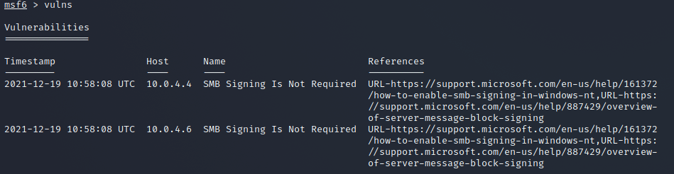

# Vulnerability Scanning
- Quickly scan a target IP range for known vulnerabilities
- Valuable info for pen tester, however results may have a high false positive and false negative rate.
- Vulnerability scanning can also trigger detection alarms

## SMB Login Check
- Connects to a range of hosts to test a known good username/password combination
- Extremely noisy; shows up as a failed logon attempt on any Windows target
- Successful results can be added to the windows/smb/psexec exploit module to create Meterpreter Sessions
- A "+" on the left column will indicate a successful login:

- Note as this is a logon, it will be detected in windows as a 4624 Event ID.

## Commands
| **Command** | **Description** |
| --------------|-------------------|
|`use auxiliary/scanner/smb/smb_login`| uses the smb login scanner |
|`show options`| shows the scanner options |
|`set RHOSTS 10.0.0.0/24`| scans the specified subnet range |
|`set SMBUser Admin`| Set the username to use |
|`set SMBPass`| Set the password to use |
|`set THREADS 50`| Set the CPU THREAD count |
|`run`| do it |

## VNC Authentication
- Auxiliary module which searches a range of IP addresses looking for targets without a password configured.
- Represents low hanging fruit, i.e. sloppy administration. 
- Output looks similar to the below.

## Commands
| **Command** | **Description** |
| --------------|-------------------|
|`use auxiliary/scanner/vnc/vnc_none_auth`| uses the vnc no auth scanner|
|`show options`| shows the scanner options |
|`set RHOSTS 10.0.0.0/24`| scans the specified subnet range |
|`set THREADS 50`| Set the CPU THREAD count |
|`run`| do it |

## WMAP Web Scanner
- Web application scanner created from a tool named SQLMap
- Requires a new database to store the WMAP scan results in. 
- Running the "vulns" commands after running the scanner will display the results of the scan.

## Commands
| **Command** | **Description** |
| --------------|-------------------|
|`load wmap`| opens the scanner console |
|`help`| shows the scanner help |
|`wmap_sites -a http://10.10.10.10`| adds a target url |
|`wmap_targets -t http://10.10.10.10/mutillidae/index.php`| Adds the sites given path as a target |
|`wmap_targets -l`| List the defined targets |
|`wmap_targets -c`| Clear the list of defined targets |
|`wmap_run -h`| Scan the target system |
|`wmap_run -t`| List modules to scan the target system |
|`wmap_run -e`| Initiate the scan |
|`wmap_vulns -l`| Once the scan is finished, look at the database for items of interest |

## Nexpose & Nessus
- Both nexpose and nessus can be run from the metasploit console directly via plugins
- Below are example commands assuming an account with nexpose or nessus

## Nexpose Commands
| **Command** | **Description** |
| --------------|-------------------|
|`load nexpose`| opens the nexpose console |
|`help`| shows the scanner help |
|`nexpose_connect -h`| Lists the help menu for the nexpose_connect cmd |
|`nexpose_connect loneferret:something@127.0.0.1:3780 ok`| Connects to the nexpose server with our credentials |
|`nexpose_scan  -c ssh:msfadmin:msfadmin -t full-audit 172.16.194.172`| Scans the metasploitable VM with full creds |
|`services`| Lists running services |
|`vulns`| Lists located vulnerabilities |
|`nexpose_discover`| Runs a minimal discovery scan |
|`nexpose_dos`| Runs a discovery scan and denial of service checking |
|`nexpose_exhaustive`| Scans all TCP ports and aull authorized safe checks |
|`systemctl start nexposeconsole`| Starts the nexpose console| 
|`https://127.0.0.1:3780/`|Nexpose local address|

## Nessus Commands
| **Command** | **Description** |
| --------------|-------------------|
|`load nessus`| opens the nessus console |
|`nessus_connect dook:s3cr3t@192.168.1.100 ok`| connects to the nessus server |
|`nessus_policy_list`| Lists the nessus policies available for scanning |
|`nessus_scan_new 1 pwnage 192.168.1.161`| Runs a Nessus scan from an policy, use the command followed by the policy ID number, a name for your scan, and target |
|`nessus_scan_status`| Lists the progress of the nesssus scan |
|`nessus_report_list`| Lists all reports after a scan has been completed |
|`nessus_report_get`| Imports a specific scan report |
|`vulns`| Once a scan is imported, you can run the vulns commmand |

## Postgres Commands
| **Command** | **Description** |
| --------------|-------------------|
|`systemctl start postgresql`| starts postgres |
|`sudo msfdb init`| initializes the postgres db |
|`sudo msfdb start`| starts the postgres metasploit db |
|`sudo msfdb status`| checks the kali db status |
|`db_status`| checks the db status in metasplot |
| `msfdb run` `msfconsole -q` | Runs the databse and opens the metasplot console |
|`ps -ef | grep postgres`| Verify a database is running a process |
|`sudo find /tmp/ -name .s.PGSQL.5432`| Locates the name of the database sockets |
|`psql -h /tmp/ <dbname>`| Explicity connect to the database |
|`pg_lsclusters`| Lists all the postgres clusters running on your device |
|`sudo pg_ctlcluster 9.6 main start`| Restart a postgres cluster |
|`sudo service postgresql restart`| Restart the postgres service |
|`/var/log/postgresql/postgresql-9.6-main.log`| Location of the postgres logs |
|`/usr/share/metasploit-framework/config/database.yml`| Location of msf database config file |