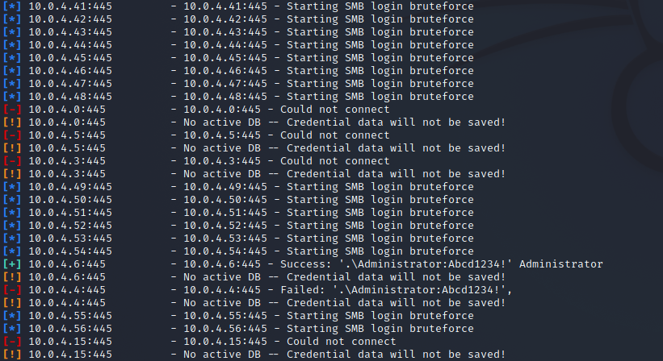

# Vulnerability Scanning
- Quickly scan a target IP range for known vulnerabilities
- Valuable info for pen tester, however results may have a high false positive and false negative rate.
- Vulnerability scanning can also trigger detection alarms

## SMB Login Check
- Connects to a range of hosts to test a known good username/password combination
- Extremely noisy; shows up as a failed logon attempt on any Windows target
- Successful results can be added to the windows/smb/psexec exploit module to create Meterpreter Sessions
- A "+" on the left column will indicate a successful login:

- Note as this is a logon, it will be detected in windows as a 4624 Event ID.
WindowsLogonEvent.png

## Commands
| **Command** | **Description** |
| --------------|-------------------|
|`use auxiliary/scanner/smb/smb_login`| uses the smb login scanner |
|`show options`| shows the scanner options |
|`set RHOSTS 10.0.0.0/24`| scans the specified subnet range |
|`set SMBUser Admin`| Set the username to use |
|`set SMBPass`| Set the password to use |
|`set THREADS 50`| Set the CPU THREAD count |
|`run`| do it |

## VNC Authentication
- Auxiliary module which searches a range of IP addresses looking for targets without a password configured.
- Represents low hanging fruit, i.e. sloppy administration. 
- Output looks similar to the below.

## Commands
| **Command** | **Description** |
| --------------|-------------------|
|`use auxiliary/scanner/vnc/vnc_none_auth`| uses the vnc no auth scanner|
|`show options`| shows the scanner options |
|`set RHOSTS 10.0.0.0/24`| scans the specified subnet range |
|`set THREADS 50`| Set the CPU THREAD count |
|`run`| do it |

## WMAP Web Scanner
- Web application scanner created from a tool named SQLMap
- Requires a new database to store the WMAP scan results in. 
- Running the "vulns" commands after running the scanner will display the results of the scan

## Commands
| **Command** | **Description** |
| --------------|-------------------|
|`load wmap`| opens the scanner console |
|`help`| shows the scanner help |
|`wmap_sites -a http://10.10.10.10`| adds a target url |
|`wmap_targets -t http://10.10.10.10/mutillidae/index.php`| Adds the sites given path as a target |
|`wmap_targets -l`| List the defined targets |
|`wmap_targets -c`| Clear the list of defined targets |
|`wmap_run -h`| Scan the target system |
|`wmap_run -t`| List modules to scan the target system |
|`wmap_run -e`| Initiate the scan |
|`wmap_vulns -l`| Once the scan is finished, look at the database for items of interest |

## Nexpose

## Nessus