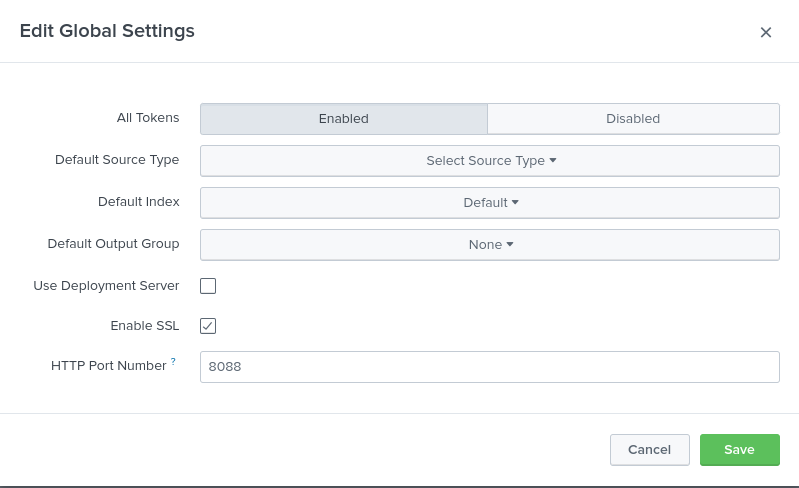

# Push VPC Flow Logs to Splunk using Kinesis Firehose
- VPC Flow Logs are network flow data in AWS, i.e. source ip, source port, destination ip, destination port, etc. This data can be leveraged in Splunk to search for (Reconnaissance Tactics)[https://attack.mitre.org/tactics/TA0043/]

- Below are my notes walking through the steps necessarry to push VPC flow logs into splunk.
(https://aws.amazon.com/premiumsupport/knowledge-center/push-flow-logs-splunk-firehose/)[https://aws.amazon.com/premiumsupport/knowledge-center/push-flow-logs-splunk-firehose/]

# Prerequisites
- Setup a Splunk HEC HTTP Event Collector (HEC) Instance.
- Create a new HEC endpoint along with a new token for configuring the VPC Flow logs data stream.
- Install the Splunk add-on for Amazon Kinesis Data Firehose.

## Splunk HEC HTTP Event Collector
[https://docs.splunk.com/Documentation/Splunk/7.1.1/Data/UsetheHTTPEventCollector](https://docs.splunk.com/Documentation/Splunk/7.1.1/Data/UsetheHTTPEventCollector)
[https://www.youtube.com/watch?v=9awwyjORWO8](https://www.youtube.com/watch?v=9awwyjORWO8)
- HTTP Event Collector (HEC) lets you send data and application events to a Splunk deployment over HTTP and HTTPS protocols. 
- HEC requries generating a token and then configuring a logging library or HTTP client to send the HEC data in a specific format.
- No heavy forwarder is required here.
- Tokens: Agents and clients use this token to authenticate ther connections to HEC. When a client connects, they present this token value. If the HEC collector recieves a valid token, they recieve the data in json or txt.

### Steps
* The Following steps are for Splunk Enterprise.
1. Settings > Add Data > monitor > HTTP Event Collector > Global Setings > "Enabled"
2. Other options are optional. Click Save.


## Splunk HEC Endpoint with new token

### Steps
[https://docs.splunk.com/Documentation/Splunk/7.1.1/Data/UsetheHTTPEventCollector](https://docs.splunk.com/Documentation/Splunk/7.1.1/Data/UsetheHTTPEventCollector)
* Enable indexer acknowledgement.
1. Settings > Add Data > Monitor > HTTP Event Collector
2. Complete the required configuration data:
    Name: aws_vpc_flow_logs
    Enable indexer acknowledgement: TICK


# Install the Splunk add-on for Amazon Kinesis Data Firehose
- The add on can be installed: Splunk > Apps > Find More Apps > "Splunk Add-on for Amazon Kinesis Firehose"

# Splunk HEC Configurations
https://prd-p-fwca4.splunkcloud.com/en-US/manager/search/http-eventcollector
8088

# Finish creating the Kinesis Data Firehose delivery stream
- Enter the Splunk Hec Details:
https://inputs.prd-p-fwca4.splunkcloud.com:8088
- Token Value: d9e37978-3775-4d10-bf6d-74434b9003b2

# Create a test web server instance 
```
#!/bin/bash
# Use this for your user data (script from top to bottom)
# install httpd (Linux 2 version)
yum update -y
yum install -y httpd
systemctl start httpd
systemctl enable httpd
echo "<h1>Hello World from $(hostname -f)</h1>" > /var/www/html/index.html
```

# Create a Kinesis Integration Role
```
aws iam create-role --role-name CWLtoKinesisFirehoseRole --assume-role-policy-document file://TrustPolicyForCWLToFireHose.json
```

# Attach the newly created policy
```
aws iam put-role-policy 
    --role-name CWLtoKinesisFirehoseRole 
    --policy-name Permissions-Policy-For-CWL 
    --policy-document file://PermissionPolicyForCWLToFireHose.json
```
# Create a Kinesis Subscription Filter
```
aws logs put-subscription-filter 
   --log-group-name "vpc-flow-logs-test"
   --filter-name "Destination" 
   --filter-pattern "" 
   --destination-arn "arn:aws:firehose:ap-southeast-2:897497140670:deliverystream/PUT-SPK-EOXAD" 
   --role-arn "arn:aws:iam::897497140670:role/CWLtoKinesisFirehoseRole"
```


# Scatchpad:

The standard form for the HEC URI in Splunk Cloud Platform free trials is as follows: 
<protocol>://inputs.<host>:<port>/<endpoint>

https://inputs.prd-p-fwca4.splunkcloud.com:8088/aws_vpc_flow_kinesis

https://inputs.prd-p-fwca4.splunkcloud.com:8088/services/collector/raw
https://inputs.prd-p-fwca4.splunkcloud.com:8088/services/collector/
https://inputs.prd-p-fwca4.splunkcloud.com:8088/services/collector/event


curl -k https://inputs.prd-p-fwca4.splunkcloud.com:8088/services/collector/event -H "Authorization: Splunk d9e37978-3775-4d10-bf6d-74434b9003b2" -d '{"event": "hello world"}'

curl -k https://inputs.prd-p-fwca4.splunkcloud.com:8088/services/collector/raw -H "Authorization: Splunk d9e37978-3775-4d10-bf6d-74434b9003b2" -d '{"event": "hello world"}'

curl -k https://inputs.prd-p-fwca4.splunkcloud.com:8088/services/collector/ -H "Authorization: Splunk d9e37978-3775-4d10-bf6d-74434b9003b2" -d '{"event": "hello world"}'


4830858e-b546-4cb3-80fa-a2cf4dab7bc5